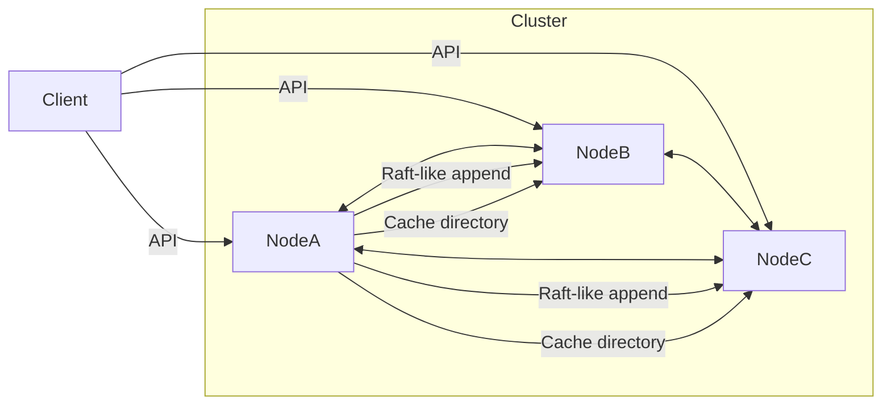

# Architecture

## Overview
- Setiap node menjalankan FastAPI service yang berperan sebagai:
  - Distributed lock manager (konsensus append log)
  - Distributed queue (consistent hashing)
  - Distributed cache coherence (MESI-like directory)
- Leader dipilih statis via `LEADER_ID` dan bertindak sebagai koordinator konsensus dan cache.
- Komunikasi antar-node memakai HMAC signature dan opsional AES-GCM.

## Diagram (Mermaid)

## Core Components
1. **Consensus (Raft-like)**
   - Leader menerima command dan mereplikasi log ke follower.
   - Commit jika quorum tercapai, lalu apply ke state machine.
2. **Distributed Lock**
   - Lock disimpan sebagai resource + owner + TTL.
   - Keputusan lock dilakukan melalui consensus log.
3. **Distributed Queue**
   - Sharding via consistent hashing.
   - Producer/consumer bisa hit node mana pun, request akan diteruskan ke node yang tepat.
4. **Cache Coherence (MESI-like)**
   - Directory di leader mengatur state M/E/S/I.
   - Invalidate dan writeback dikirim ke node lain sesuai state.

## Security
- `X-API-Key` untuk akses eksternal.
- `X-Cluster-Signature` untuk autentikasi antar-node.
- AES-GCM (opsional) jika `ENCRYPTION_KEY` diisi.
