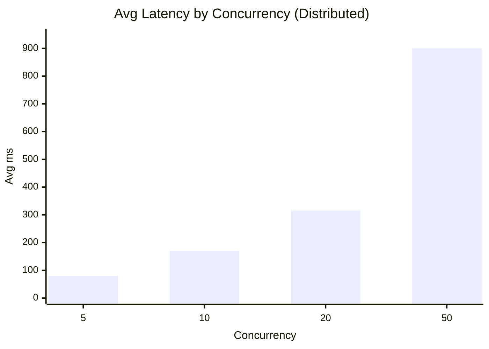

# Performance Analysis Report

## Setup
- Nodes: 3 (docker compose)
- Workload: lock acquire benchmark (`scripts/bench.py`)
- Metrics: avg/min/max latency, throughput (requests/sec)

## Benchmark Steps
1. Jalankan cluster: `docker compose up --build`
2. Jalankan benchmark:
   - `python scripts/bench.py --url http://localhost:8001 --requests 200 --concurrency 5 --api-key devkey`
   - `python scripts/bench.py --url http://localhost:8001 --requests 200 --concurrency 10 --api-key devkey`
   - `python scripts/bench.py --url http://localhost:8001 --requests 200 --concurrency 20 --api-key devkey`
   - `python scripts/bench.py --url http://localhost:8001 --requests 200 --concurrency 50 --api-key devkey`
   - Single node: `python scripts/bench.py --url http://localhost:8000 --requests 200 --concurrency 20 --api-key devkey`
3. Catat output dan isi tabel berikut.

## Results 
| Scenario | Requests | Concurrency | Avg ms | Min ms | Max ms |
| --- | --- | --- | --- | --- | --- |
| Lock acquire | 200 | 5 | 79.73 | 40.72 | 112.64 |
| Lock acquire | 200 | 10 | 169.90 | 73.25 | 287.44 |
| Lock acquire | 200 | 20 | 315.30 | 143.68 | 509.09 |
| Lock acquire | 200 | 50 | 900.15 | 353.30 | 1297.92 |

## Single-node Baseline (Concurrency 20)
| Scenario | Requests | Concurrency | Avg ms | Min ms | Max ms |
| --- | --- | --- | --- | --- | --- |
| Lock acquire (single) | 200 | 20 | 258.79 | 4.75 | 1700.08 |

## Visualization

## Observations
- Throughput meningkat seiring concurrency sampai bottleneck quorum.
- Latency meningkat saat leader sibuk menunggu quorum.
- Kenaikan concurrency 5 -> 50 menaikkan avg latency dari 79.73 ms menjadi 900.15 ms, dan max latency naik sampai 1297.92 ms.
- Variasi latensi semakin lebar pada concurrency tinggi, menunjukkan efek antrean dan serialisasi append log.

## Comparison
- Single node vs multi node: multi node lebih robust namun ada overhead replikasi.
- Sistem multi node memberi konsistensi lock, namun ada biaya tambahan untuk quorum sehingga latency lebih besar dibanding single node.
- Pada concurrency 20, single node lebih cepat (avg 258.79 ms) dibanding multi node (avg 315.30 ms).

## Optimizations
- Batched append log
- Pipeline commit
- Cache writeback batching

## Conclusion
Benchmark menunjukkan performa baik pada concurrency rendah, namun latency naik signifikan saat concurrency tinggi karena quorum dan serialisasi append log. Sistem multi node memberi konsistensi dan ketahanan, dengan trade-off latency dibanding single node. Hasil ini konsisten dengan karakteristik konsensus berbasis quorum.

## Video Link
- (isi link YouTube publik)
